# E-Prescription System

> Note: This case study documents a real professional project completed during **2020-2021** at **Beximco Pharmaceuticals Ltd.** The original source code is private due to company confidentiality and ownership restrictions.

## Overview

The E-Prescription System was a doctor-facing healthcare web application developed at **Beximco Pharmaceuticals Ltd.** during **2020-2021**. I worked on this project **with another team member**.

The system was designed to digitize patient intake, queue handling, prescription preparation, follow-up workflow, and printable prescription generation. It supported doctor-side operational use through a structured interface for patient data entry, clinical information capture, medication entry, investigation history, advice management, and prescription printing.

This was not a static website. It was a real workflow-driven internal medical application used to support consultation and prescription-related work.

## Business Problem

Prescription handling and patient consultation workflows become inefficient when patient data, symptoms, investigations, advice, and medicine details are managed manually or across disconnected processes.

This project addressed problems such as:
- manual patient entry and queue handling
- fragmented prescription preparation workflow
- difficulty organizing structured patient medical information
- the need for reusable master data such as symptoms, investigations, advice, and drug advice
- the need for a clean printable prescription output for consultation use
- the need for configurable prescription and patient form fields depending on usage context

## Users

The main users of the system were:
- **Doctors**, who created prescriptions, reviewed patient records, and managed treatment-related information
- **Internal assistants or staff**, depending on configuration and workflow support
- **Patients indirectly**, through the printed prescription and maintained consultation record

The screenshots also indicate configurable assistant support and doctor profile setup within the system.

## My Role

I worked as a **software developer** on this project together with another team member. My contribution was in application development, workflow-oriented feature implementation, data-driven backend functionality, and support for a real internal healthcare system.

## Project Year

**2020-2021**

## Team

- Worked with **another team member**
- Developed as part of professional work at **Beximco Pharmaceuticals Ltd.**

## Tech Stack

- PHP
- MySQL
- HTML
- CSS
- JavaScript
- jQuery
- Bootstrap
- CKEditor

## Key Features

Based on the available project materials and screenshots, the system supported:

### Core patient workflow
- login-based doctor access
- dashboard with patient queue and patient search
- add patient flow with detailed patient data entry
- patient list and patient queue management
- patient detail view with prescription history by visit date
- follow-up support and queue movement

### Prescription workflow
- create prescription from patient details
- add symptoms with duration
- add examination information such as pulse and BP
- add investigations with date, findings, and unit
- add advised investigations
- add drug history
- add provisional diagnosis and final diagnosis
- add medications with dose, suggestion, and advice
- save and print prescription
- ready-to-print prescription format

### Master data / administration workflow
- symptom management
- clinical history management
- investigation management
- advice management
- drug advice management
- product entry
- global configuration for patient form and prescription form behavior
- doctor profile editing
- password change and user settings

## What I Built

My contributions included work across structured healthcare workflow features such as:
- doctor-side patient entry and patient management flow
- prescription preparation interface
- data entry forms for symptoms, investigations, diagnosis, and medication
- CRUD-style management pages for reusable medical/supporting data
- settings and profile-oriented functionality
- support for printable prescription output
- maintenance and enhancement of a real business application in production context

## Evidence from Screenshots

The uploaded screenshots show that the system included all of the following real modules and workflows:

- **Login panel**
- **Dashboard**
- **Add Patient**
- **Patient Queue**
- **Patient List**
- **Patient Details / visit history**
- **Prescription creation**
- **Save & Print flow**
- **Ready-to-print prescription output**
- **Symptom Management**
- **Advice Management**
- **Drug Advice Management**
- **Clinical History Management**
- **Investigation Management**
- **Product entry**
- **Global Configuration**
- **Doctor profile editing**
- **Password change**

## Selected Screenshots

### Login
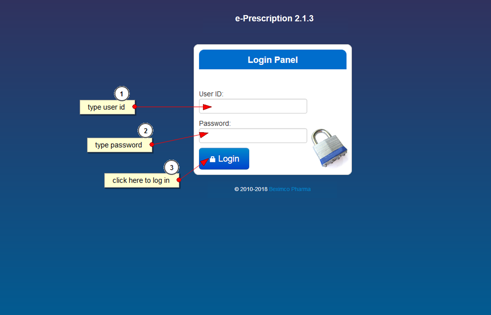

### Dashboard
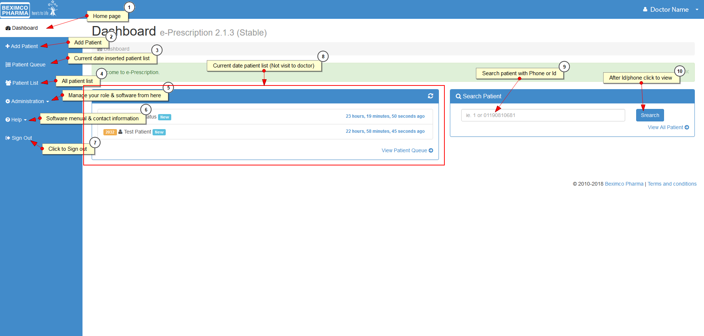

### Add Patient
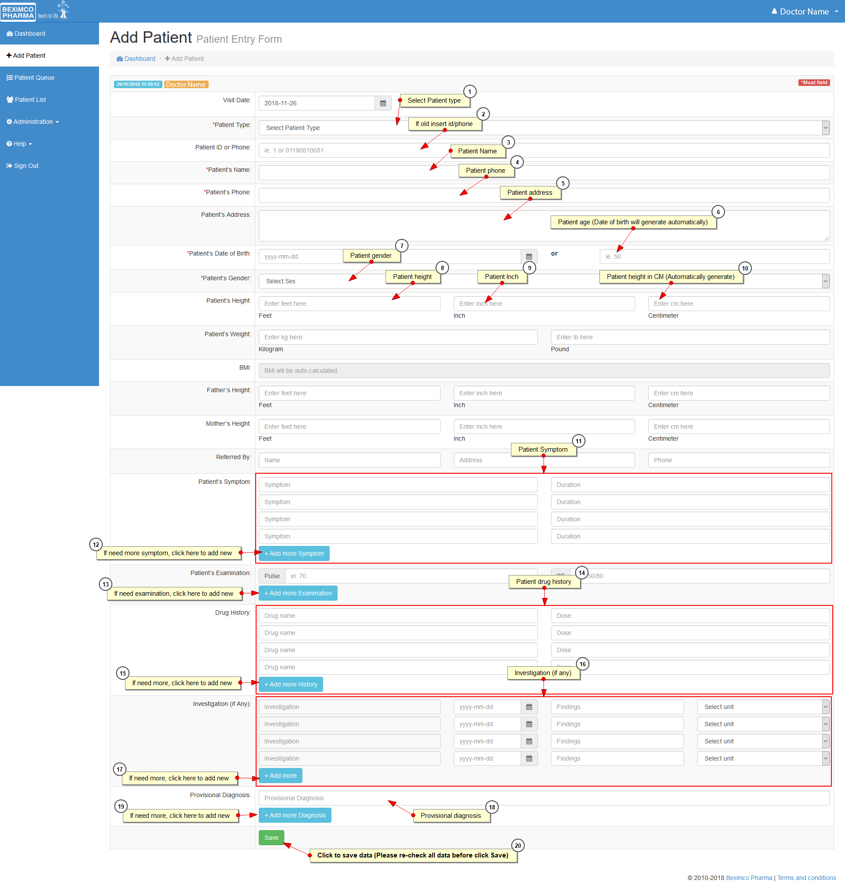

### Prescription Creation
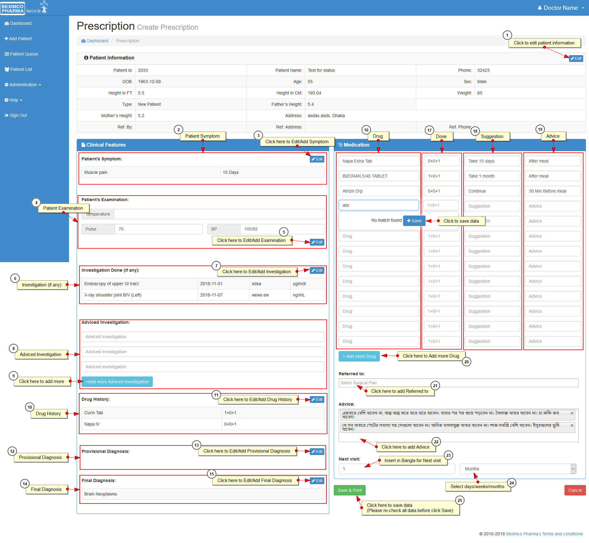

### Save and Print Flow
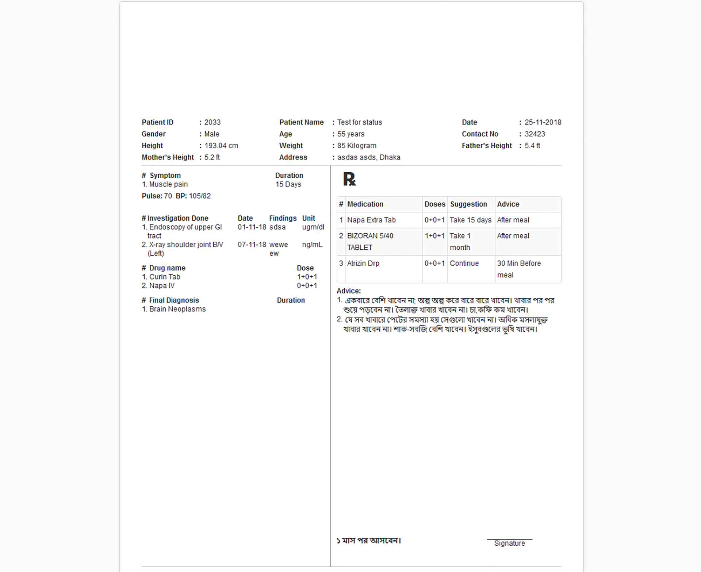

### Patient Details / Prescription View
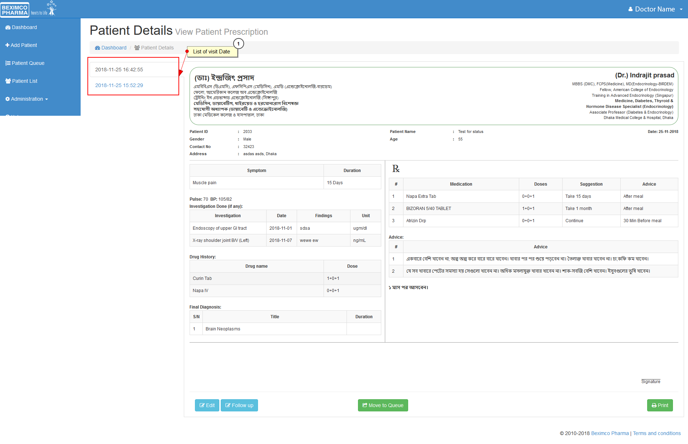

### Printable Prescription Output
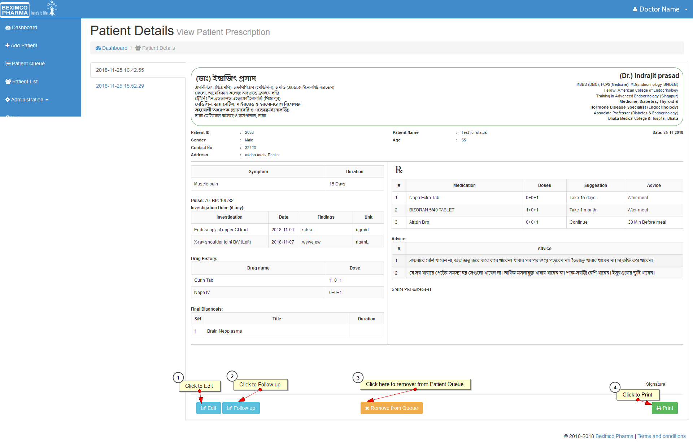

### Symptom Management
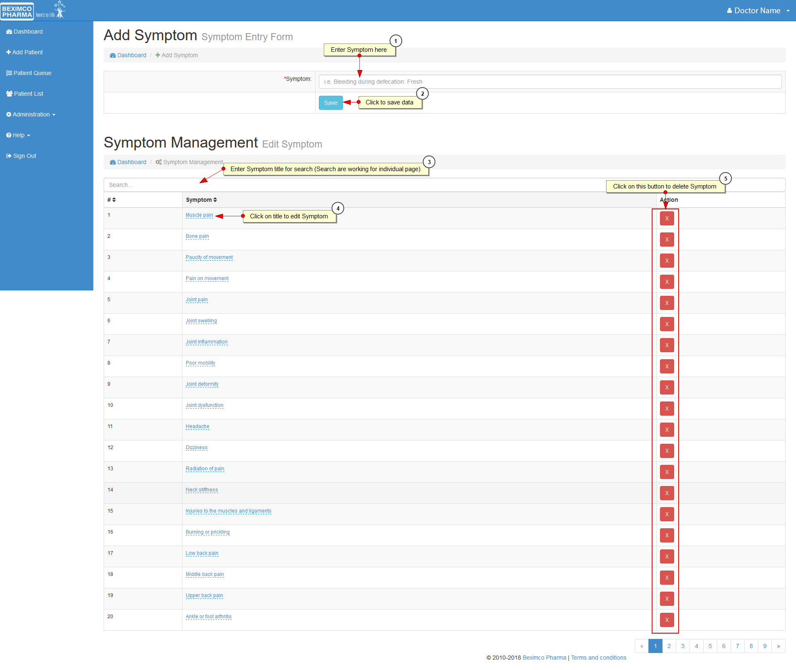

### Advice Management
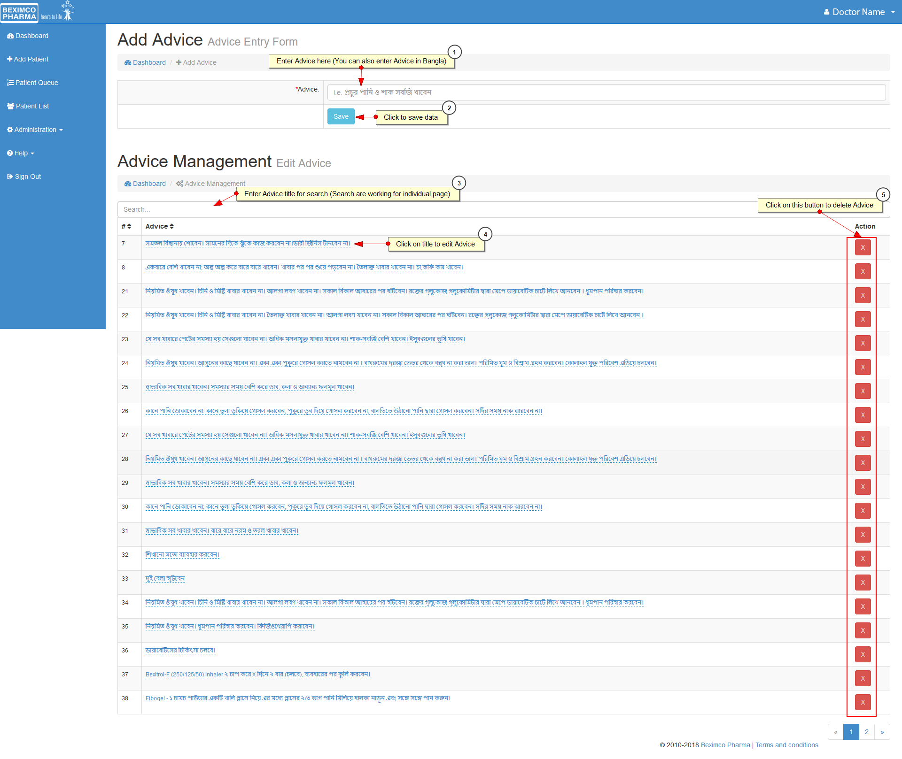

### Clinical History Management
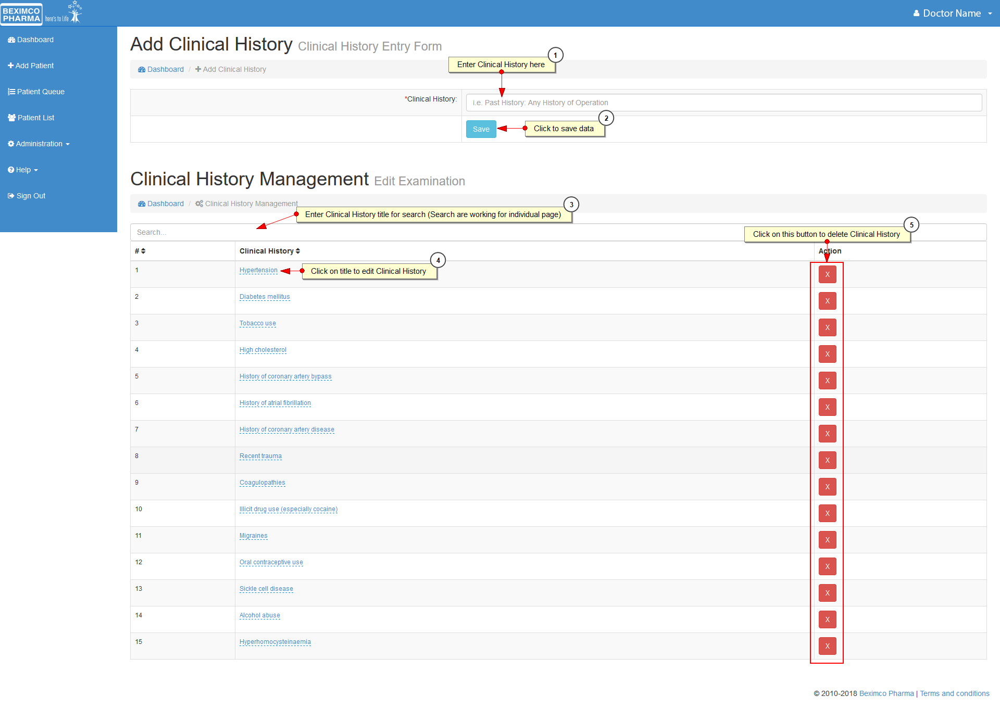

### Investigation Management
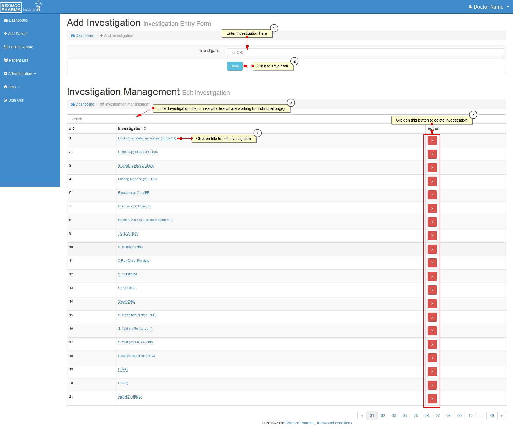

### Global Configuration
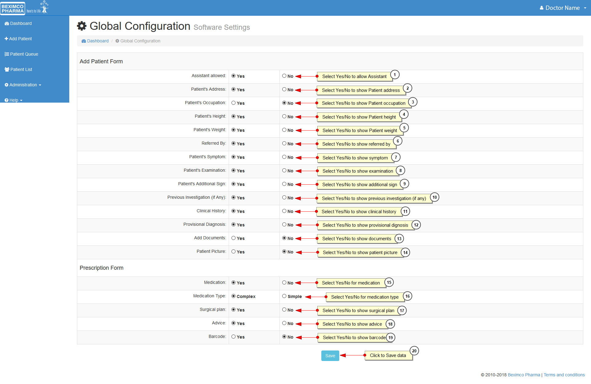

### Doctor Profile
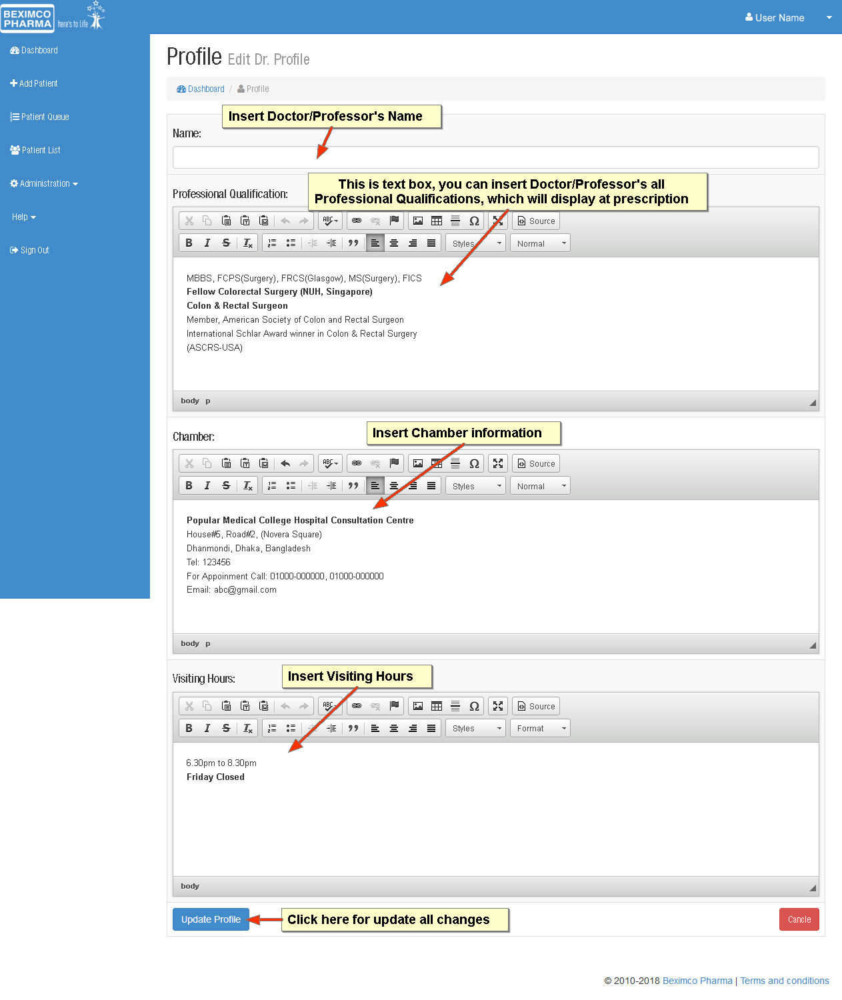

## What Makes This Project Strong

This is one of the strongest projects in my earlier professional experience because it demonstrates:

- real business software development
- healthcare/pharma domain exposure
- structured patient and prescription workflow
- database-backed internal application design
- multiple connected modules rather than a single form or page
- configurable system behavior
- printable operational output
- production-style CRUD, workflow, and admin functionality

For software engineering roles, this project is strong because it shows I worked on a real internal system with meaningful workflow complexity, not only a brochure website.

## Lessons Learned

This project helped me strengthen:
- workflow-based application design thinking
- form-heavy and data-heavy web development
- relational data handling in practical business scenarios
- CRUD-oriented module design for reusable master data
- healthcare-oriented software structure and operational usability
- how to build systems that support real users in day-to-day work

It also improved my understanding of how a business application grows through connected modules like queue handling, patient history, diagnosis, medication, advice, investigations, settings, and printing.

## Confidentiality Note

This case study is based on my real professional work and selected non-sensitive screenshots.

The original source code is not published because it was developed in a company environment and is subject to confidentiality and ownership restrictions. This document intentionally avoids exposing proprietary code, credentials, sensitive data, or internal infrastructure details.
