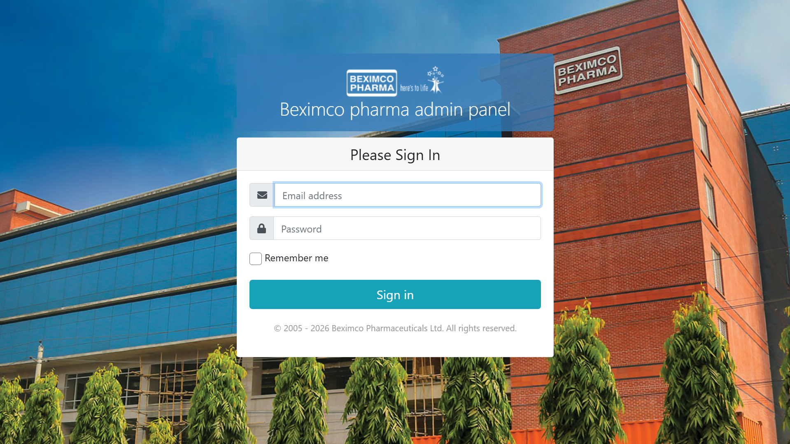
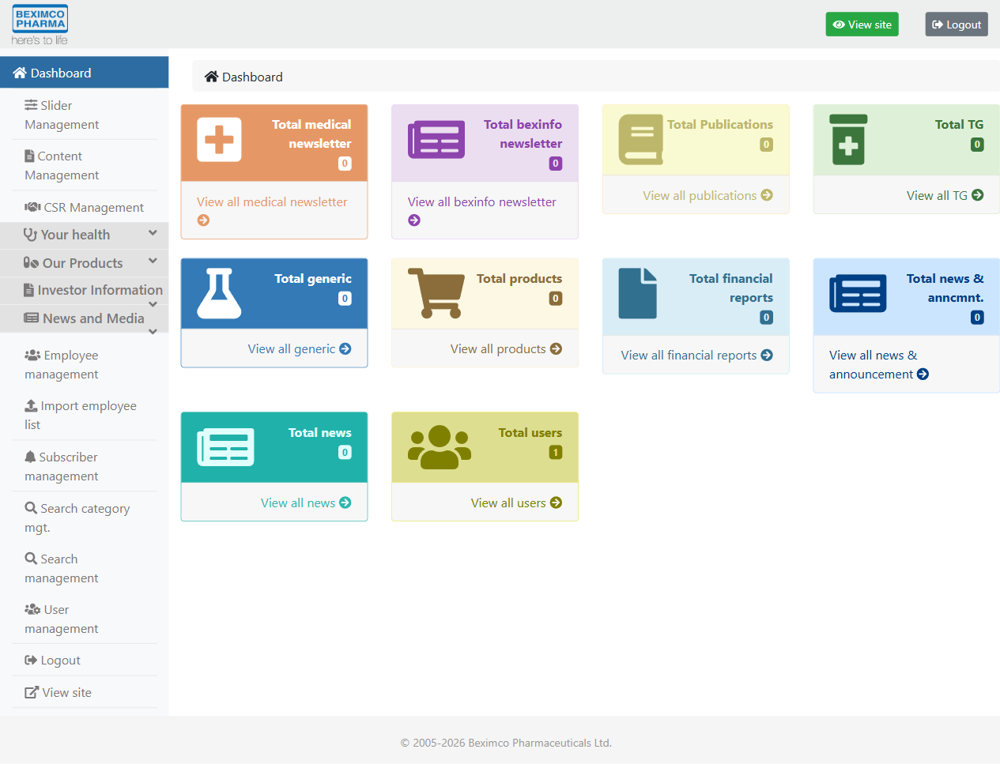
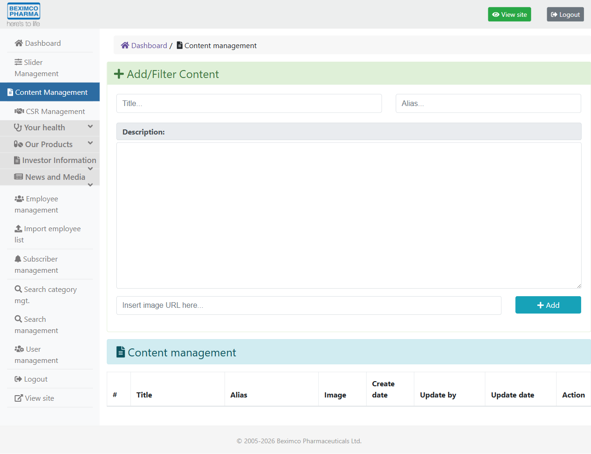
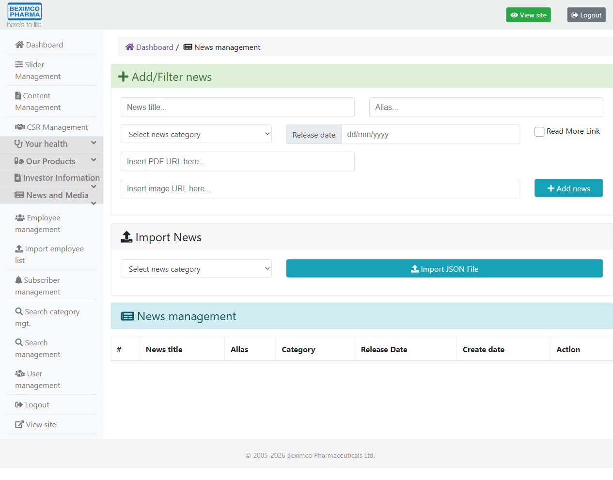
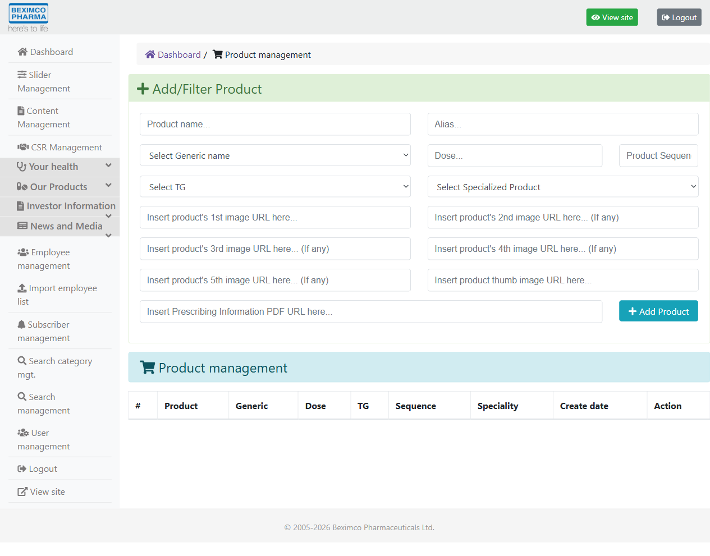
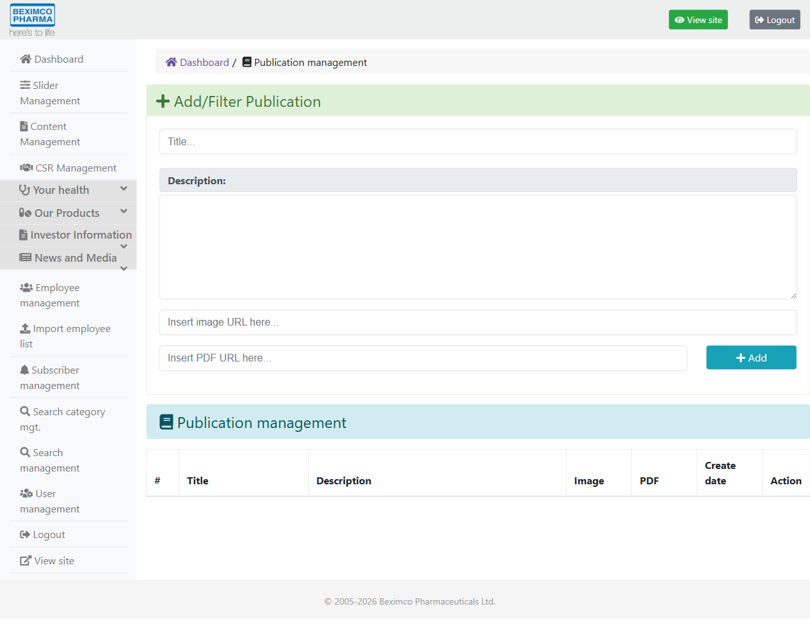
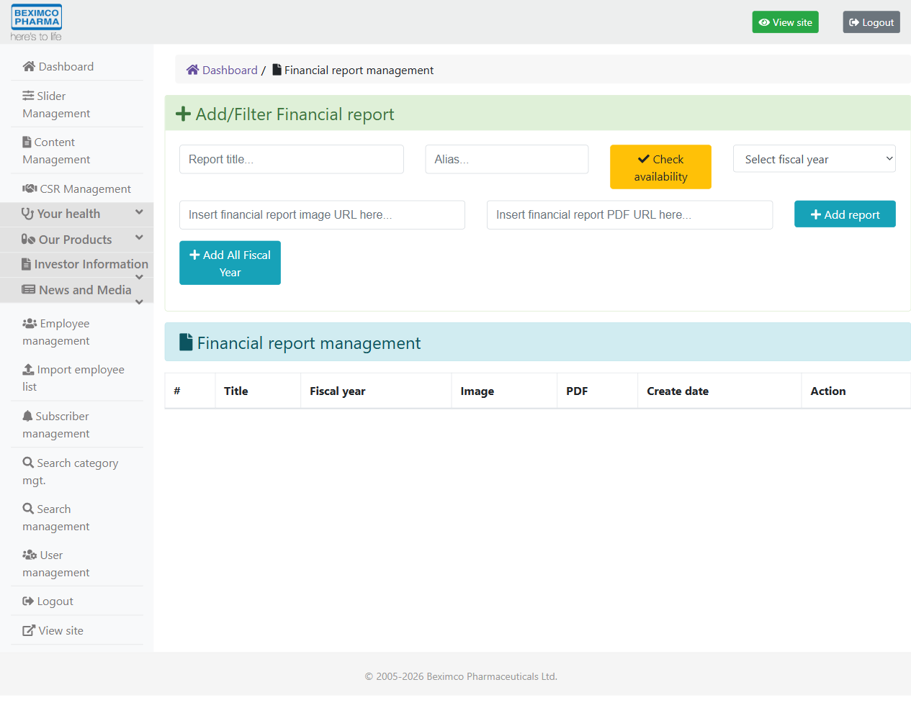
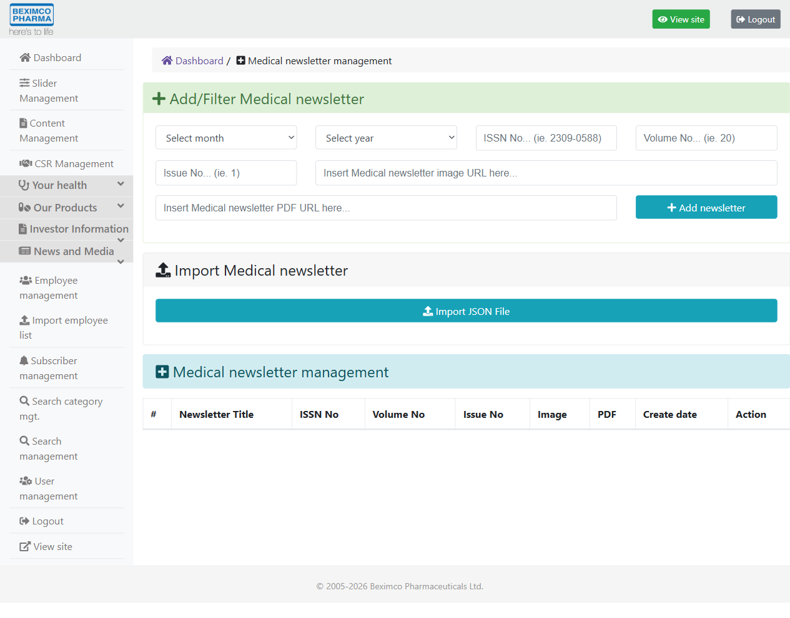
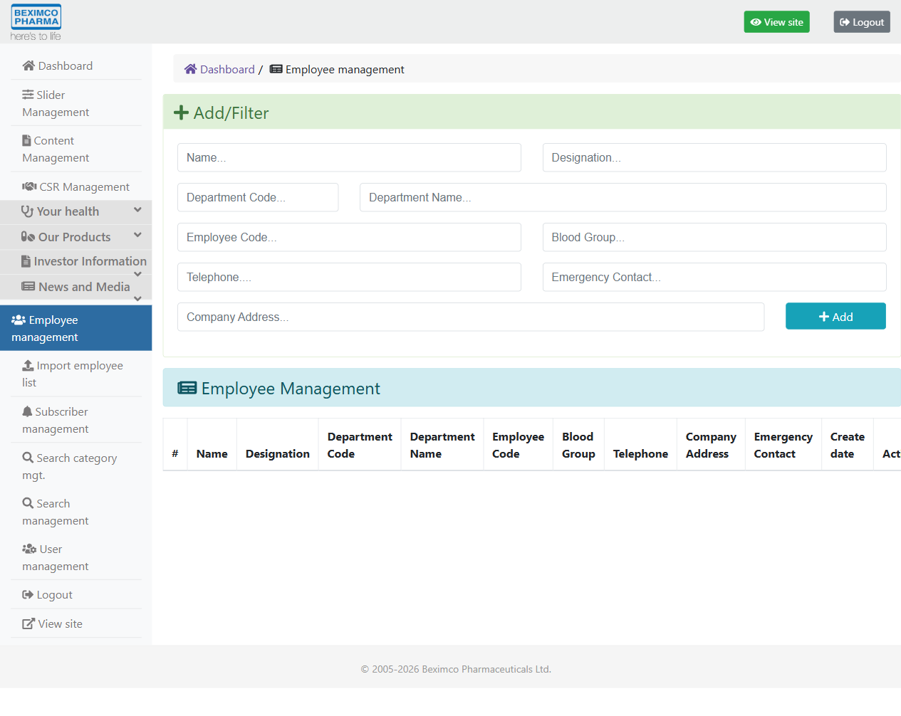

# Beximco Pharma Corporate Site with CMS

> Note: This case study documents a real professional project completed during **2021-2023** at **Beximco Pharmaceuticals Ltd.** The original source code is private due to company confidentiality and ownership restrictions.

## Overview

The Beximco Pharma Corporate Site with CMS was a corporate web platform developed to support the company’s public-facing digital presence together with structured content management workflows.

This was more than a static corporate website. It was a content-driven web application built to support corporate communication, modular content publishing, and maintainable presentation across multiple business-facing sections. The platform combined public website delivery with CMS-oriented workflows for managing and presenting content in a structured way.

## Project Link

- **Live website:** [beximcopharma.com](https://beximcopharma.com/)

> Public site link provided for reference. The live website may have changed over time after my contribution period.

## Business Problem

A large corporate website needs more than brochure-style pages. It must present information clearly, support consistent branding, and make content updates manageable across multiple sections.

This project addressed needs such as:
- maintaining a professional public-facing digital presence
- presenting corporate information in a structured and consistent way
- supporting content updates without manually editing every page
- handling multiple content categories such as news, events, documents, media, and careers
- improving site maintainability across a large content-driven web platform
- supporting search and navigation across different types of published content

## Users

The platform served two broad user groups:
- **External visitors**, who accessed company information and public-facing content
- **Internal content or business users**, who needed CMS-oriented workflows for content publishing and updates

## My Role

I contributed as a **software developer** on this project in a professional company environment. My work included website feature implementation, frontend development for content-driven pages, support for CMS-oriented workflows, and maintenance of a real production corporate platform.

## Project Year

**2021-2023**

## Tech Stack

- Meteor
- MongoDB
- HTML
- CSS
- JavaScript
- jQuery ecosystem components
- Summernote

## Key Features

The platform supported the following core areas.

### Corporate website experience
- public-facing corporate content pages
- structured navigation and section-based layout
- branded UI and consistent presentation across page types

### CMS-oriented content support
- rich text editing
- content-driven page management
- reusable presentation patterns for different sections
- maintainable publishing-oriented frontend structure

### Content modules
- news-related content
- events-related content
- document-oriented pages
- photo and media-related sections
- career-related content
- FAQ-style support
- catalog and content detail presentation
- search and search results pages
- map and location-related functionality

### Frontend behavior and presentation
- content listing and detail views
- media and gallery-style components
- search interface support
- pagination and structured content browsing
- calendar and event-related presentation
- modular UI behavior across multiple content sections

## What I Built

My contributions included work on:
- corporate website feature implementation
- frontend development for content-driven pages
- support for CMS-oriented editing and presentation workflows
- structured content display across multiple modules
- maintenance and enhancement of a production corporate website
- support for reusable and modular page behavior across different site sections

## System Modules

## System Modules

The platform included internal content and administration modules such as:
- dashboard
- slider management
- specialized product management
- TG management
- generic management
- product management
- fiscal year management
- financial reports management
- news and announcements management
- bexinfo category and content management
- news category and news management
- medical newsletter management
- search management
- user management
- employee management
- subscriber management
- publication management
- content management
- culture, health, disease information, and CSR-related management

## Selected Screenshots

### Login

### Dashboard

### Content Management

### News Management

### Product Management

### Publication Management

### Financial Reports Management

### Medical Newsletter Management

### Employee Management

## What Makes This Project Strong

This project is valuable in a software engineering portfolio because it demonstrates:
- work on a real company website in a production environment
- full-stack JavaScript application exposure through Meteor
- CMS-oriented and content-driven web development
- modular frontend and content architecture
- maintainability across multiple content categories and page types
- delivery and support of a large corporate platform rather than a small static site

It is especially useful as supporting proof of professional web delivery, content platform work, and real-world production maintenance.

## Lessons Learned

This project strengthened my understanding of:
- how large corporate websites differ from small personal or brochure-style websites
- how content structure and CMS workflows affect frontend implementation
- how to build and maintain modular content sections across news, events, documents, careers, search, and media
- how maintainability matters in production content-driven platforms
- how business websites require both presentation quality and operational editability

It also improved my understanding of how engineering work on a corporate platform sits between frontend delivery, structured content systems, and maintainable application behavior.

## Confidentiality Note

This case study is based on my real professional work.

The original source code is not published because it was developed in a company environment and is subject to confidentiality and ownership restrictions. This document intentionally avoids exposing proprietary code, credentials, internal infrastructure details, or business-sensitive implementation details.
